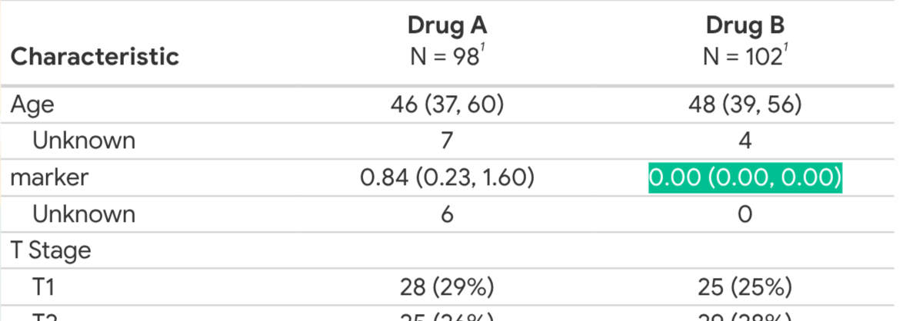

```{r}
#| echo: false
suppressPackageStartupMessages({
  library(tidyverse)
  library(sumExtras)
  library(gtsummary)
  library(gt)
})
```

# Introduction
 
> **sumExtras**: "gt**sum**mary table **Extras**"


## The plan
::: {.incremental}
+ Apply a JAMA-ready theme
+ Customize missing values with `clean_table()`
+ One-line table formatting with `extras()`
+ Auto-label tables with `add_auto_labels()`
  + Create a variable dictionary
  + Set package options
+ Add variable group headers
+ Style and color group rows
+ Put it all together in one pipeline
:::


## What we'll build

(insert final table image here)

Also testing the GitHub action here


## Creating a summary table

Results from a simulated study of two chemotherapy agents.

A dataset containing the baseline characteristics of 200 patients who received Drug A or Drug B. Dataset also contains the outcome of tumor response to the treatment.

```{r}
#| echo: true
#| eval: true
gtsummary::trial
```

##

Most times, we're faced with datasets with missing values.  
Let's `mutate` in some `0` and `NA` values.

```{r}
#| echo: true
#| eval: true
#| code-line-numbers: "|17"
dat <- trial |>
  mutate(
    marker = case_when(
      trt == "Drug B" ~ 0,
      .default = marker
    ),
    grade = case_when(
      trt == "Drug B" ~ NA,
      .default = grade
    )
  )
head(dat, 5)
```

## Initial `gtsummary` table

:::: {.columns}
::: {.column}
```{r}
#| eval: false
dat |>
  tbl_summary(by = trt)
```
::: {.fragment}
Oh no! This table seems to run off the page!
:::

:::

::: {.column}
```{r}
#| echo: false
dat |>
  tbl_summary(by = trt)
```
:::
::::


## Setting a theme

Use `sumExtras::use_jama_theme()` for a more compact table.

::: {.fragment}
`use_jama_theme()` is just a wrapper function for `gtsummary::theme_gtsummary_compact("jama")`
:::

<br>

:::: {.columns}
::: {.column}
```{r}
#| eval: false
sumExtras::use_jama_theme()

dat |>
  tbl_summary(by = trt)
```
:::

::: {.column}
```{r}
#| echo: false
use_jama_theme()
dat |>
  tbl_summary(by = trt)
```
:::
::::


## Cleaning the table

{width="50%"}

Draw attention to complete, non-`NA` values with `clean_table()` by replacihng `0 (0.00, 0.00)`, `0 (NA%)`, and other similar values with an emdash (`—`).

## Cleaning the table

```{r}
#| eval: false
dat |>
  tbl_summary(by = trt) |>
  clean_table()
```

:::: {.columns}
::: {.column}
Without `clean_table()`
```{r}
#| echo: false
use_jama_theme()
dat |>
  tbl_summary(by = trt)
```
:::

::: {.column}
With `clean_table()`
```{r}
#| echo: false
use_jama_theme()
dat |>
  tbl_summary(by = trt) |>
  clean_table()
```
:::
::::


## Adding labels, *p*-values, and other goodies

```{r}
#| echo: false
dat |>
  tbl_summary(
    by = trt,
    label = list(
      age ~ "Age at Enrollment (years)",
      marker ~ "Marker Level (ng/mL)",
      stage ~ "T Stage",
      grade ~ "Tumor Grade",
      response ~ "Tumor Response",
      death ~ "Patient Died"
    )
  ) |>
  modify_header(label = "") |>
  bold_labels() |>
  add_p() |>
  bold_p() |>
  add_overall() |>
  clean_table()
```

::: {.incremental .smallest}
* Removed "Characteristic" from variable heading
* Added *p*-values
* Bold labels & significant *p*-values
* Added "Overall" column
* Applied `clean_table()`
:::


## Adding labels, *p*-values, and other goodies

:::: {.columns}
::: {.column}
```{r}
#| eval: false
dat |>
  tbl_summary(
    by = trt,
    label = list(
      age ~ "Age at Enrollment (years)",
      marker ~ "Marker Level (ng/mL)",
      stage ~ "T Stage",
      grade ~ "Tumor Grade",
      response ~ "Tumor Response",
      death ~ "Patient Died"
    )
  ) |>
  modify_header(label = "") |>
  bold_labels() |>
  add_p() |>
  bold_p() |>
  add_overall() |>
  clean_table()
```
:::

::: {.column}
```{r}
#| eval: false
dat |>
  tbl_summary(
    by = trt,
    label = list(
      age ~ "Age at Enrollment (years)",
      marker ~ "Marker Level (ng/mL)",
      stage ~ "T Stage",
      grade ~ "Tumor Grade",
      response ~ "Tumor Response",
      death ~ "Patient Died"
    )
  ) |>
  extras()
```
:::{.fragment}
Six lines converted to one!
:::

:::

::::


## Creating a Variable Dictionary

A dictionary object is a data frame with two columns:  
* `variable`  
* `description`

<!-- Show the creation of the data dictionary object
Highlight lines, then show the created object incrementally to the side -->

:::: {.columns}
::: {.column width="55%"}
```{r}
#| echo: true
#| code-line-numbers: "|1|2"
dictionary <- tibble::tribble(
  ~variable,    ~description,
  "trt",        "Chemotherapy Treatment",
  "age",        "Age at Enrollment (years)",
  "marker",     "Marker Level (ng/mL)",
  "stage",      "T Stage",
  "grade",      "Tumor Grade",
  "response",   "Tumor Response",
  "death",      "Patient Died"
)
```
:::
::: {.column width="45%" .fragment}
```{r}
dictionary
```
:::
::::

::: {.incremental}
::: {.callout-note .fragment}
The column names are case-*in*sensitive. `variable`, `Variable`, and `VARIABLE`
will work all the same.
:::
:::


<!-- SLIDE OUTLINE
1. INTRO: Show verbose gtsummary-only code (the "before")
   - tbl_summary(by=trt) |> add_overall() |> add_p() |> bold_labels() |>
     bold_p() |> modify_header(...) |> modify_table_body(...)
   - Preview the final sumExtras version we're building toward

2. THEME: use_jama_theme() before/after comparison
   - Show default gtsummary output vs JAMA-themed output

3. CLEAN TABLE: clean_table() for missing values
   - Show table with ugly NA/0 patterns, then pipe on clean_table()

4. EXTRAS: extras() replaces repeated boilerplate
   - Show how one call replaces add_overall, add_p, bold_labels, bold_p,
     modify_header, clean_table
   - Mention key arguments: pval, overall, last, header, symbol

5. AUTO LABELS: add_auto_labels() with dictionary
   - Show dictionary creation (already built above)
   - Demonstrate label priority: manual > attributes > dictionary
   - Show package options: sumExtras.auto_labels, sumExtras.prefer_dictionary

6. GROUP HEADERS: add_variable_group_header()
   - Add grouping to organize variables in the table

7. GROUP STYLING & COLORS: add_group_styling() + add_group_colors()
   - Style group rows, add color — visual payoff
   - add_group_colors() must be last (converts to gt)

8. OUTRO: Full pipeline side-by-side
   - Verbose gtsummary code vs clean sumExtras pipeline
   - Circle back to the "before" from slide 1
-->
