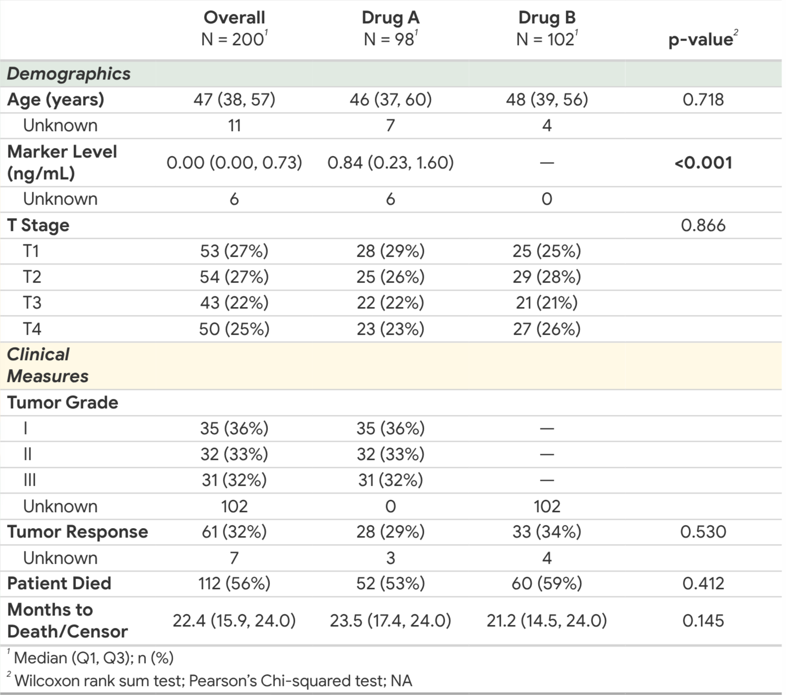
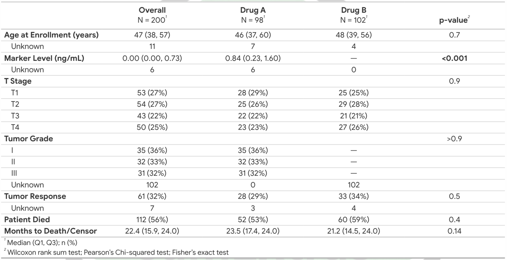
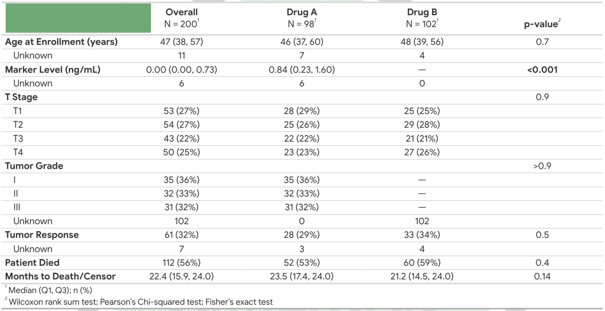
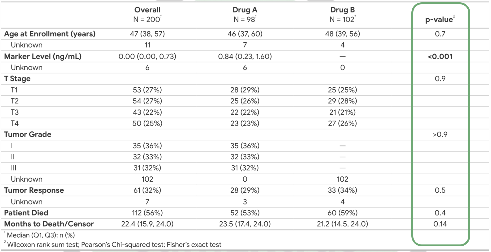
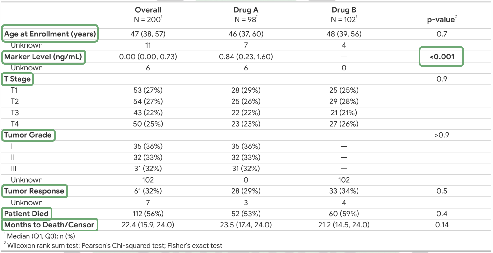
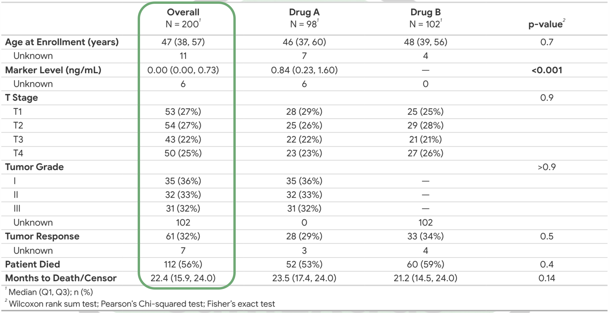
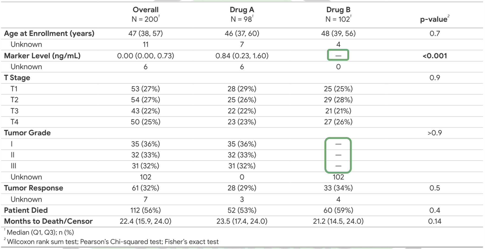

```{r}
#| echo: false
suppressPackageStartupMessages({
  library(tidyverse)
  library(sumExtras)
  library(gtsummary)
  library(gt)
})

options(
  sumExtras.auto_labels = FALSE,
  sumExtras.prefer_dictionary = FALSE,
  digits = 4
)
```

# Introduction
 
> **sumExtras**: "gt**sum**mary table **Extras**"


## What we'll learn:

::: {.incremental}
+ where are the slides? 😁
+ `gtsummary` basics
+ Table theming
+ Variable labeling
+ Address missing values
+ The `extras()` function
+ Variable grouping & styling
:::


## Go from this... 

```{r}
#| echo: false
trial |>
  tbl_summary(by = trt)
```


## To this!

{fig-align="center"}


## And the slides are here:

https://slides.kyleGrealis.com/sumExtras

The docs:
https://www.kyleGrealis.com/sumExtras

How to install:

```{r}
#| eval: false
install.packages("sumExtras")
pak::pak("sumExtras")
pak::pak("kyleGrealis/sumExtras")

# Watch me break things:
remotes::install_github("kyleGrealis/sumExtras@dev")
```


## `gtsummary::trial` dataset

Results from a simulated study of two chemotherapy agents

A dataset containing the baseline characteristics of 200 patients who received
Drug A or Drug B. Dataset also contains the outcome of tumor response to the
treatment.

```{r}
#| echo: true
#| eval: true
gtsummary::trial
```


## `gtsummary` basics (part 1)

Create a stratified table using the `by` parameter

```{r}
#| output-location: column
trial |> 
  gtsummary::tbl_summary(by = trt)
```


## `gtsummary` basics (part 2)

Setting a compact theme

```{r}
#| output-location: column
#| code-line-numbers: "|2"
# Set once at the top of your table script
sumExtras::use_jama_theme()

trial |> 
  tbl_summary(by = trt)
```

::: {.incremental .smaller}
* `use_jama_theme()` is a wrapper function for \
 `gtsummary::set_gtsummary_theme(theme_gtsummary_compact("jama"))`
* If your data contains label attributes, `gtsummary` will print
those automatically,  
as in the table above
:::


## `gtsummary` basics (part 3)

Pass a list of labels

```{r}
#| output-location: column
#| code-line-numbers: "|4-12"
trial |> 
  tbl_summary(
    by = trt,
    label = list(
      age ~ "Age (years)",
      marker ~ "Marker Level (ng/mL)",
      stage ~ "T Stage",
      grade ~ "Tumor Grade",
      response ~ "Tumor Response",
      death ~ "Patient Died",
      ttdeath ~ "Month to Death/Censor"
    )
  )
```

## Add labels, *p*-values, and other goodies
{width=85%}  

This is more like what I want...

## Add labels, *p*-values, and other goodies
{width=85%}  

Removed "Characteristic" from variable heading

## Add labels, *p*-values, and other goodies
{width=85%}  

Added *p*-values

## Add labels, *p*-values, and other goodies
{width=85%}  

Bold labels & significant *p*-values

## Add labels, *p*-values, and other goodies
{width=85%}  

Added "Overall" column

## Add labels, *p*-values, and other goodies
{width=85%}  

Clean up missing values


## Simulate missing values

```{r}
#| echo: true
#| code-line-numbers: "|4,8,18,22"
trial <- trial |>
  mutate(
    marker = case_when(
      trt == "Drug B" ~ 0,
      .default = marker
    ),
    grade = case_when(
      trt == "Drug B" ~ NA,
      .default = grade
    )
  )

head(trial)
```


## `gtsummary` basics (part 4)

Add *p*-values, bold labels, and introducing `clean_table()`

```{r}
#| output-location: column
#| code-line-numbers: "|14|15|16|17|18|19"
trial |> 
  tbl_summary(
    by = trt,
    label = list(
      age ~ "Age (years)",
      marker ~ "Marker Level (ng/mL)",
      stage ~ "T Stage",
      grade ~ "Tumor Grade",
      response ~ "Tumor Response",
      death ~ "Patient Died",
      ttdeath ~ "Month to Death/Censor"
    )
  ) |> 
  modify_header(label = "") |>
  bold_labels() |>
  add_p() |>
  bold_p() |>
  add_overall() |> 
  sumExtras::clean_table()
```


## `clean_table()`

{width="45%"}

**THE GOAL:**

+ Draw attention to complete data.

::: {.fragment}
+ Replace missingness patterns with an emdash (`—`).
:::

## Cleaning the table

```{r}
#| eval: false
trial |>
  tbl_summary(by = trt) |>
  clean_table()
```

:::: {.columns}
::: {.column}
Without `clean_table()`
```{r}
#| echo: false
trial |>
  tbl_summary(
    by = trt,
    label = list(
      age ~ "Age (years)",
      marker ~ "Marker Level (ng/mL)",
      stage ~ "T Stage",
      grade ~ "Tumor Grade",
      response ~ "Tumor Response",
      death ~ "Patient Died",
      ttdeath ~ "Month to Death/Censor"
    )
  )
```
:::

::: {.column}
With `clean_table()`
```{r}
#| echo: false
trial |>
  tbl_summary(
    by = trt,
    label = list(
      age ~ "Age (years)",
      marker ~ "Marker Level (ng/mL)",
      stage ~ "T Stage",
      grade ~ "Tumor Grade",
      response ~ "Tumor Response",
      death ~ "Patient Died",
      ttdeath ~ "Month to Death/Censor"
    )
  ) |> 
  clean_table()
```
:::
::::


# Reusable labeling

::: {.incremental}
* Create a variable `dictionary` object
* Use `sumExtras` auto-labeling
:::


## Creating a variable dictionary

A `dictionary` is a data frame with `variable` and `description` columns.

:::: {.columns}
::: {.column width="55%"}
```{r}
#| echo: true
#| code-line-numbers: "|2"
dictionary <- tibble::tribble(
  ~variable,    ~description,
  "trt",        "Chemotherapy Treatment",
  "age",        "Age (years)",
  "marker",     "Marker Level (ng/mL)",
  "stage",      "T Stage",
  "grade",      "Tumor Grade",
  "response",   "Tumor Response",
  "death",      "Patient Died"
)
```
:::
::: {.column width="45%"}
```{r}
dictionary
```
:::
::::

::: {.fragment}
With a `dictionary` in scope, labels can be applied automatically.
:::


## Using `add_auto_labels()`

```{r}
#| output-location: column
#| code-line-numbers: "|1-3|8-16|24"
options(
  sumExtras.prefer_dictionary = TRUE
)

trial |>
  tbl_summary(
    by = trt,
    # label = list(
    #   age ~ "Age (years)",
    #   marker ~ "Marker Level (ng/mL)",
    #   stage ~ "T Stage",
    #   grade ~ "Tumor Grade",
    #   response ~ "Tumor Response",
    #   death ~ "Patient Died",
    #   ttdeath ~ "Month to Death/Censor"
    # )
  ) |> 
  modify_header(label = "") |>
  bold_labels() |>
  add_p() |>
  bold_p() |>
  add_overall() |> 
  clean_table() |> 
  add_auto_labels()
```


## Reduce the code

No more writing `label = list(...)` for every table!

```{r}
#| output-location: column
options(
  sumExtras.prefer_dictionary = TRUE
)

trial |>
  tbl_summary(by = trt) |> 
  modify_header(label = "") |>
  bold_labels() |>
  add_p() |>
  bold_p() |>
  add_overall() |> 
  clean_table() |> 
  add_auto_labels()
```


## Reduce the code some more: 

Introducing `extras()`

```{r}
#| output-location: column
#| code-line-numbers: "|2|8-14|2,15"
options(
  sumExtras.auto_labels = TRUE,
  sumExtras.prefer_dictionary = TRUE
)

trial |>
  tbl_summary(by = trt) |> 
  # modify_header(label = "") |>
  # bold_labels() |>
  # add_p() |>
  # bold_p() |>
  # add_overall() |> 
  # clean_table() |> 
  # add_auto_labels()
  extras()
```


## Code comparison

:::: {.columns}
::: {.column}
```{r}
#| eval: false
#| code-line-numbers: "3-12,14-20"
trial |>
  tbl_summary(
    by = trt,
    label = list(
      age ~ "Age (years)",
      marker ~ "Marker Level (ng/mL)",
      stage ~ "T Stage",
      grade ~ "Tumor Grade",
      response ~ "Tumor Response",
      death ~ "Patient Died",
      ttdeath ~ "Month to Death/Censor"
    )
  ) |> 
  modify_header(label = "") |>
  bold_labels() |>
  add_p() |>
  bold_p() |>
  add_overall() |> 
  clean_table() |> 
  add_auto_labels()
```
:::

::: {.column}
```{r}
#| eval: false
#| code-line-numbers: "3"
trial |>
  tbl_summary(by = trt) |> 
  extras()
```

Seventeen lines converted to one!

:::

::::

:::{.fragment}
Not including the `options()` and `dictionary` 😉
:::


# Variable grouping & adding color

## Variable grouping {.col-45-55}

```{r}
#| output-location: column
#| code-line-numbers: "|12"
trial |>
  tbl_summary(by = trt) |>
  extras() |>
  add_variable_group_header(
    header = "Demographics",
    variables = age:stage
  ) |>
  add_variable_group_header(
    header = "Clinical Measures",
    variables = grade:ttdeath
  ) |>
  sumExtras::add_group_styling()
```

::: {.incremental}
+ **bold** & *italic* group headers 
+ restores left-justified variable indentation
:::


## Add gray group background {.col-45-55}

```{r}
#| output-location: column
#| code-line-numbers: "|13"
trial |>
  tbl_summary(by = trt) |>
  extras() |>
  add_variable_group_header(
    header = "Demographics",
    variables = age:stage
  ) |>
  add_variable_group_header(
    header = "Clinical Measures",
    variables = grade:ttdeath
  ) |>
  sumExtras::add_group_styling() |>
  sumExtras::add_group_colors()
```


## Add color group background {.col-45-55}

```{r}
#| output-location: column
#| code-line-numbers: "|13-15"
trial |>
  tbl_summary(by = trt) |>
  extras() |>
  add_variable_group_header(
    header = "Demographics",
    variables = age:stage
  ) |>
  add_variable_group_header(
    header = "Clinical Measures",
    variables = grade:ttdeath
  ) |>
  sumExtras::add_group_styling() |>
  sumExtras::add_group_colors(
    color = c("#E1EAE2", "#FFF9E6")
  )
```

::: {.fragment}
**NOTE:** `add_group_colors()` CONVERTS the table to a `gt` table to apply the tweaks! Use this function as the *last* step in the pipeline.
:::


## And this is what we built!

{fig-align="center"}


# Extra `extras()`!!!

What if you don't want the defaults?

## `extras()` parameters

```{r}
#| eval: false
#| code-line-numbers: "|2|3|4|5|6|7-8"
extras(
  pval = TRUE,        # or FALSE
  overall = TRUE,     # or FALSE
  last = FALSE,       # or TRUE; gtsummary::add_overall() default
  header = "",        # removes "Characteristic" header
  symbol = "—",       # display value for clean_table()
  .args = NULL,       # list override the default (next slide)
  .add_p_args = NULL  # gtsummary::add_p() arguments
)
```

## Overrides

```{r}
#| eval: false
#| code-line-numbers: "|1-2|4-5|7-8|10-11|13-14"
# Remove p-values
extras(pval = FALSE)

# Remove Overall column
extras(overall = FALSE)

# Move Overall column to right-most column
extras(last = TRUE)

# Change "Characteristic" header
extras(header = "Variables")

# Use an emoji for clean_table()
extras(symbol = "🤨")
```


## `extras()` using `.args` parameter

Create reusable `extras()` arguments to override defaults:

```{r}
#| output-location: column
#| code-line-numbers: "|1-5|1-5,9"
extra_args <- list(
  pval = FALSE,
  last = TRUE,
  symbol = "🤨"
)

trial |> 
  tbl_summary(by = trt) |> 
  extras(.args = extra_args)
```


## `extras()` using `.add_p_args`

Create custom *p*-value testing & styling

```{r}
#| eval: false
#| code-line-numbers: "|1-5|10"
p_args <- list(
  test = list(age ~ "t.test", marker ~ "t.test"),
  pvalue_fun = ~ gtsummary::style_pvalue(
    .x, digits = 2
  )
)

trial |> 
  tbl_summary(by = trt) |> 
  extras(.add_p_args = p_args)
```


## Match gtsummary tables to gt tables

:::: {.columns}

::: {.column}

```{r}
trial |>
  tbl_summary(
    by = trt,
    include = c(age, grade, marker)
  ) |>
  extras()
```
:::


::: {.column}

```{r}
#| code-line-numbers: "|5"
trial |>
  select(trt, age, grade, marker) |>
  head(10) |>
  gt() |>
  theme_gt_compact()
```
:::

::::


## `sumExtras` supports most `gtsummary` tables

with either partial or full features available.

* `tbl_summary()`
* `tbl_svysummary()`
* `tbl_regression()`
* `tbl_uvregression()`
* `tbl_strata()`
* `tbl_merge()`


## THANK YOU! 😄

:::{.absolute bottom="30%" left="-8%"}
<span style="font-size: 50px;"><strong>Kyle Grealis, MS</strong></span>

**GitHub**: https://github.com/kyleGrealis

**Email**: kyle@kyleGrealis.com

**Slides**: https://slides.kyleGrealis.com/sumExtras

**Package**: https://www.kyleGrealis.com/sumExtras
:::

{.styled-image .absolute bottom="30%" right="1%" height="auto" width="190"}

