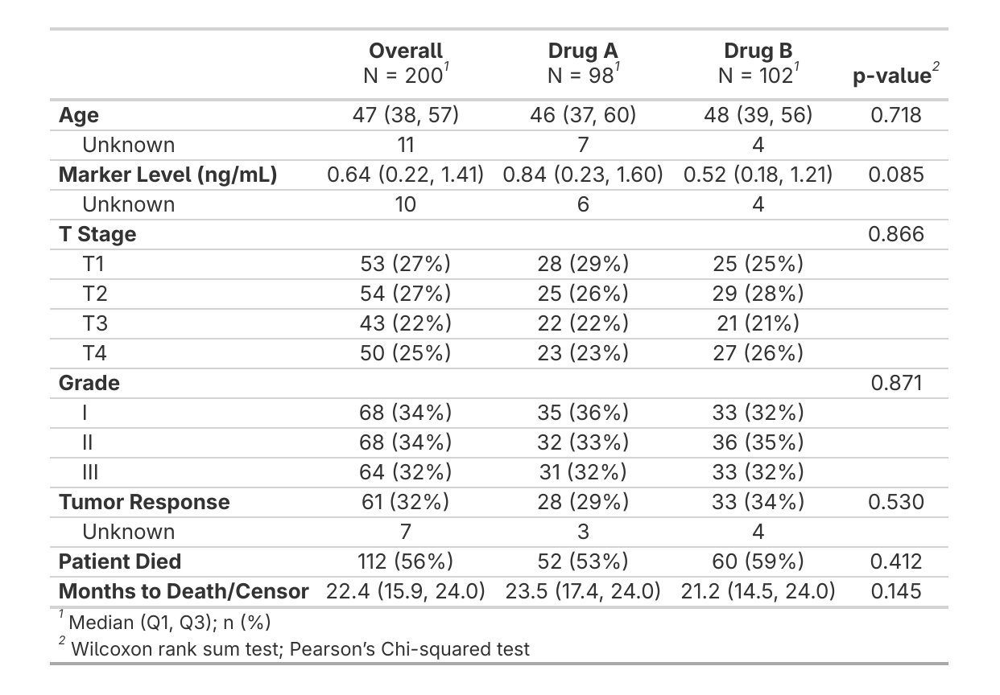

```{r, include = FALSE}
knitr::opts_chunk$set(
  collapse = TRUE,
  comment = "#>"
)

options(gtsummary.print_engine = "gt")
```

```{r setup}
#| eval: false
library(sumExtras)
library(gtsummary)
library(dplyr)

use_jama_theme()
```

```{r setup2}
#| warning: false
#| message: false
#| echo: false
library(sumExtras)
library(gtsummary)
library(dplyr)

use_jama_theme()
```

> *All examples in this vignette use the JAMA compact theme via `use_jama_theme()`. See `vignette("themes")` to set this up.*

## The `extras()` Function

If you've worked with `{gtsummary}` before, you're familiar with the typical workflow of building summary tables: creating a base table with `tbl_summary()`, then progressively adding features like overall columns, p-values, and formatting tweaks. While `{gtsummary}`'s modular approach provides flexibility, the same sequence of functions appears repeatedly in analysis scripts.

`extras()` consolidates the most common `{gtsummary}` formatting steps into one call: bold labels, a clean header, an overall column, p-values, and missing value cleanup.


<table>
<tr>
<td width="50%" valign="top">

**Standard `{gtsummary}`**

```r
theme_gtsummary_compact("jama")

trial |>
  tbl_summary(by = trt) |>
  add_overall() |>
  add_p() |>
  bold_labels() |>
  bold_p() |>
  modify_header(label = "")
```

</td>
<td width="50%" valign="top">

**With `{sumExtras}`**

```r
use_jama_theme()

trial |>
  tbl_summary(by = trt) |>
  extras()
```

</td>
</tr>
</table>

<p align="center">
  
</p>

### Customizing Output

You can control which features are applied:

```{r}
# Without p-values
trial |>
  tbl_summary(by = trt) |>
  extras(pval = FALSE)
```

```{r}
# Overall column last instead of first
trial |>
  tbl_summary(by = trt) |>
  extras(last = TRUE)
```

```{r}
# Custom header text
trial |>
  tbl_summary(by = trt) |>
  extras(header = "Variable")
```

Or pass arguments as a list for reuse across tables:

```{r}
my_args <- list(pval = TRUE, overall = TRUE, last = TRUE)

trial |>
  select(age, grade, stage, trt) |>
  tbl_summary(by = trt) |>
  extras(.args = my_args)
```

On non-stratified tables, `extras()` skips `add_overall()` and `add_p()` and applies only the formatting that makes sense. It works the same way with `tbl_regression()` --- bold labels, bold significant p-values (from the model), clean header, and missing value cleanup are applied automatically while irrelevant options are silently ignored. It never breaks your pipeline.

```{r}
# Regression tables work too
glm(response ~ age + grade, data = trial, family = binomial) |>
  tbl_regression(exponentiate = TRUE) |>
  extras()
```

For merged tables, call `extras()` on each sub-table **before** merging. All formatting (bold labels, p-values, missing symbols) carries through `tbl_merge()`, so there's no need to call `extras()` again after:

```{r, eval=FALSE}
t1 <- trial |>
  tbl_summary(by = trt, include = c(age, grade)) |>
  extras()

t2 <- trial |>
  tbl_summary(by = trt, include = c(marker, stage)) |>
  extras()

tbl_merge(list(t1, t2), tab_spanner = c("**Set A**", "**Set B**"))
```

## Cleaning Missing Values

`clean_table()` standardizes missing or zero-count representations (`"0 (NA%)"`, `"NA (NA)"`, `"NA, NA"`, etc.) to `"---"`. It runs automatically inside `extras()`, but you can also use it on its own. The `symbol` parameter controls the replacement text (default `"---"`). You can also pass `symbol` through `extras()`.

```{r}
demo_trial <- trial |>
  mutate(
    age = if_else(trt == "Drug B", 0, age),
    marker = if_else(trt == "Drug A", NA, marker)
  ) |>
  select(trt, age, marker)
```

:::::: {style="display: flex; gap: 15px; margin-bottom: 20px; align-items: flex-start;"}

::: {style="flex: 1; max-width: 48%;"}

#### Without cleaning

```{r clean-comparison-without, eval=FALSE}
demo_trial |>
  tbl_summary(by = trt)
```

:::

::: {style="flex: 1; max-width: 48%;"}

#### With clean_table()

```{r clean-comparison-with, eval=FALSE}
demo_trial |>
  tbl_summary(by = trt) |>
  clean_table()
```

:::

::::::

```{r build-clean-comparison, echo=FALSE}
table_without_clean <- demo_trial |>
  tbl_summary(by = trt)

table_with_clean <- demo_trial |>
  tbl_summary(by = trt) |>
  clean_table()
```

:::::: {style="display: flex; gap: 15px; margin-bottom: 30px; align-items: flex-start;"}

::: {style="flex: 1; max-width: 48%;"}

```{r render-without-clean, echo=FALSE}
table_without_clean
```

:::

::: {style="flex: 1; max-width: 48%;"}

```{r render-with-clean, echo=FALSE}
table_with_clean
```

:::

::::::

## Automatic Labeling

`add_auto_labels()` applies human-readable variable labels from a dictionary. Manual labels set in `tbl_summary()` always take priority.

```{r}
dictionary <- tibble::tribble(
  ~variable,    ~description,
  "trt",        "Chemotherapy Treatment",
  "age",        "Age at Enrollment (years)",
  "marker",     "Marker Level (ng/mL)",
  "stage",      "T Stage",
  "grade",      "Tumor Grade"
)

trial |>
  tbl_summary(by = trt, include = c(age, grade, marker)) |>
  add_auto_labels(dictionary = dictionary) |>
  extras()
```

For more on label priority, pre-labeled data, and auto-discovery, see `vignette("labeling")`.

## Pipeline Order

When combining with group headers and styling, order matters:

```{r, eval=FALSE}
tbl_summary(by = ...) |>
  extras() |> # always first
  add_variable_group_header() |> # after extras()
  add_group_styling() |> # format group headers
  add_group_colors() # must be last (converts to gt)
```

`add_variable_group_header()` must come after `extras()`, and `add_group_colors()` must be last since it converts the table to gt.

## Other Vignettes

* `vignette("labeling")` -- dictionary-based labeling
* `vignette("themes")` -- JAMA compact themes for `{gtsummary}` and `{gt}` for gtsummary and gt tables
* `vignette("styling")` -- group headers, formatting, and background colors
* `vignette("options")` -- .Rprofile options for automatic labeling
